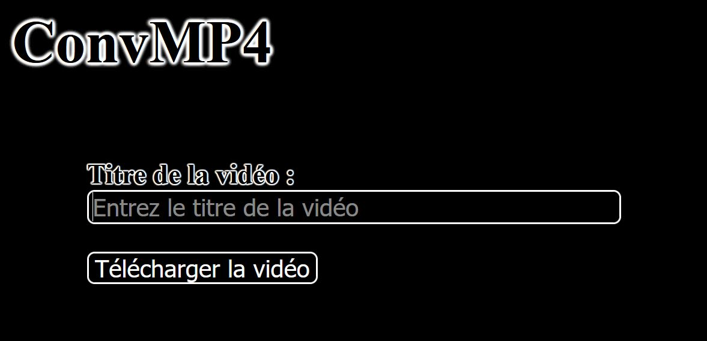
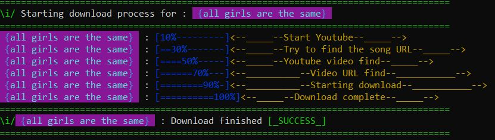

# ConvMP4

An mp4 convertor which download the mp4 file just with the video name

---

Need to install a virtuel web server like wamp : https://www.wampserver.com/

---

Need to install node.js : https://nodejs.org/en/
Need to install puppeteer module : in node type : "npm i puppeteer"

---

You need to add youtube-dl.exe and ffmpeg.exe to launching folder for it's work